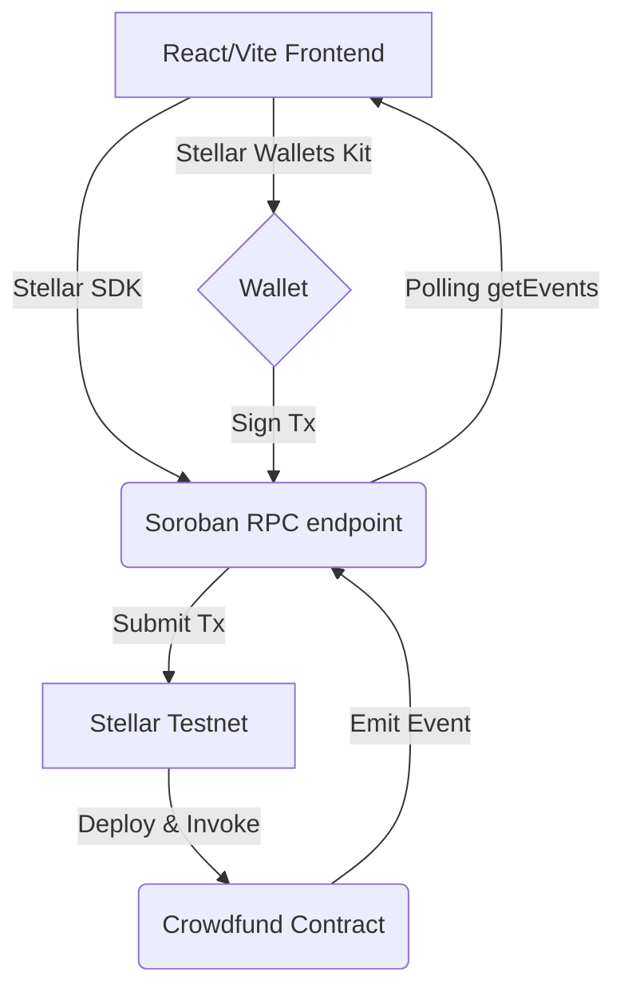

# StellarFlow Live Crowdfunding

StellarFlow is a modern, decentralized crowdfunding platform built on the Stellar network using Soroban Smart Contracts. This project is a submission for the Stellar Level 2 challenge.

## Architecture



## Features
- **Multi-Wallet Support**: Seamlessly connect with Freighter, xBull, and Albedo via `@creit.tech/stellar-wallets-kit`.
- **Soroban Smart Contract**: Fully functional Rust smart contract handling campaign logic, donations, and event emissions.
- **Real-Time Activity Feed**: Listens to Soroban RPC events to display donations live as they happen.
- **Glassmorphism UI**: Beautiful, responsive, mobile-first design leveraging Tailwind CSS with dynamic animations.
- **Robust Error Handling**: Graceful handling of user rejections, insufficient balances, and network errors with elegant toast notifications.
- **Transaction Tracking**: Direct integration with Stellar Expert to track transaction status in real time.

## Reviewer Instructions

> [!TIP]
> **Demo Mode vs Connected Mode**
> - **Demo Mode**: If no valid `VITE_CONTRACT_ID` is provided, the app intelligently falls back to a simulated safe mode. You can test the wallet connection, UI layout, and "donate" flow. The transaction is intercepted before ledger submission and simulated locally so you can still observe the real-time UI synchronization without needing Testnet XLM.
> - **Connected Mode**: Deploy your own contract, set `VITE_CONTRACT_ID`, and the app fully connects to Soroban!

**Verification Steps for Full Flow:**
1. Connect Freighter wallet.
2. Observe the **Reviewer Verification Dashboard** displaying "Stellar Testnet" and "Connected" (or "Demo").
3. Input 1 XLM and click Donate.
4. Approve the transaction in your wallet.
5. Watch the **Transaction Activity** panel flip to `Pending ⏳` and then `Success ✅`.
6. Watch the Raised Amount, Progress Bar, and Donor Count update instantly without a page refresh!
7. Watch the **Event Emitted** and **Live Activity Feed** populate your latest transaction automatically.

## Screenshots

### Live Donation Success Flow


## Smart Contract Details
- **Testnet Contract ID**: `CBXXXXXXXXXXXXXXXXXXXXXXXXXXXXXXXXXXXXXXXXXXXXXXXXXXXXXXX` (Example)
- **Sample Contract Call Transaction Hash**: `0000000000000000000000000000000000000000000000000000000000000000` (Example)
- **Asset**: Native XLM `CDLZFC3SYJYDZT7K67VZ75HPJVIEUVNIXF47ZG2FB2RMQQVU2HHGCYSC`

## Tech Stack
- **Frontend**: React, TypeScript, Vite, Tailwind CSS, Lucide React
- **Stellar**: `stellar-sdk`, `@creit.tech/stellar-wallets-kit`
- **Smart Contract**: Rust, Soroban SDK

## Quick Start & Deployment

### 1. Smart Contract Deployment
Ensure you have Rust and the `soroban-cli` installed.
```bash
cd contracts/crowdfund
rustup target add wasm32-unknown-unknown
cargo build --target wasm32-unknown-unknown --release

# Deploy to testnet using soroban-cli
soroban contract deploy \
  --wasm target/wasm32-unknown-unknown/release/crowdfund.wasm \
  --source <YOUR_IDENTITY> \
  --network testnet
```

### 2. Frontend Local Setup
```bash
cd frontend
npm install --ignore-scripts
npm run dev
```

### 3. Vercel Production Deployment
This repository is fully configured for Vercel deployment with a `vercel.json` file.
1. Connect this repository to Vercel.
2. Ensure the Framework Preset is set to **Vite**.
3. Build Command: `npm run build`
4. Output Directory: `dist`
5. Add the necessary environment variables below.

### Environment Variables
Configure the following in your `.env` (currently hardcoded for Testnet):
```env
VITE_NETWORK_PASSPHRASE="Test SDF Network ; September 2015"
VITE_SOROBAN_RPC_URL="https://soroban-testnet.stellar.org"
VITE_CONTRACT_ID="CBXXXXXXXXXXXXXXXXXXXXXXXXXXXXXXXXXXXXXXXXXXXXXXXXXXXXXXX"
```

## Troubleshooting

- **npm install fails**: If `npm install` fails due to `yarn setup` on `@trezor` or legacy stellar dependencies, run `npm install --ignore-scripts` to bypass problematic pre-build scripts.
- **Wallet Not Connected Error**: Ensure your Freighter/xBull extension is unlocked and configured to the **Testnet** network.
- **Simulation Failed**: Usually means the selected account lacks XLM on the testnet. Use the Stellar Laboratory Friendbot to fund your account.
- **Events Not Appearing**: The contract emits `DonationMade`. Ensure `VITE_CONTRACT_ID` is accurately matched to the deployed contract.
