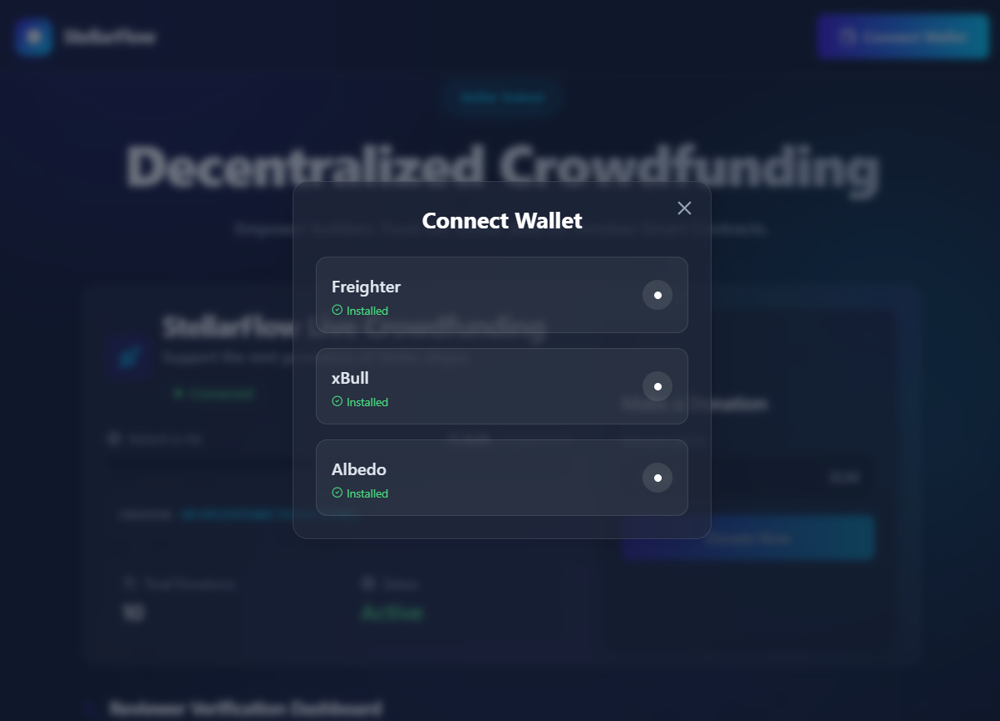
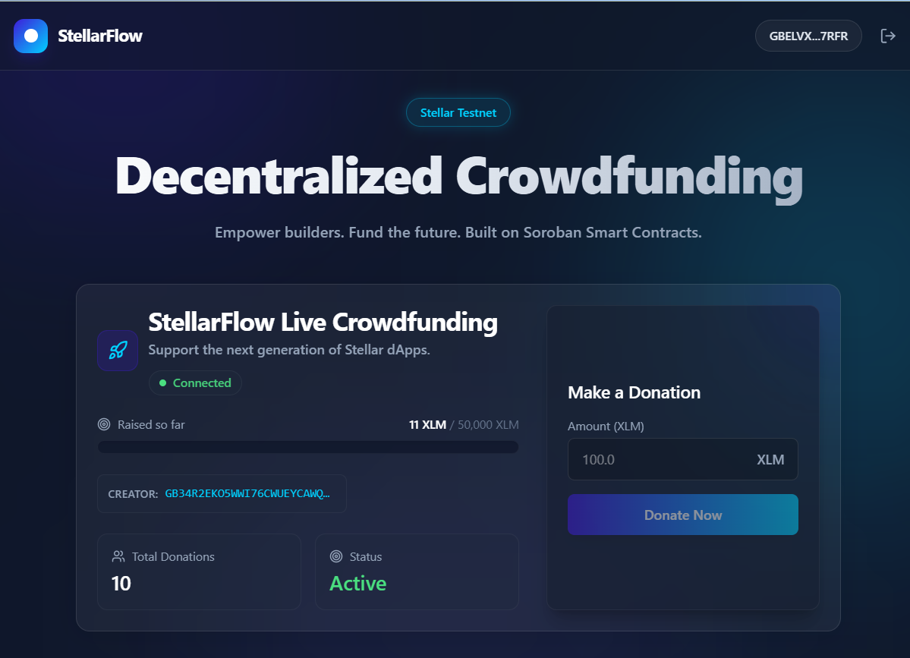
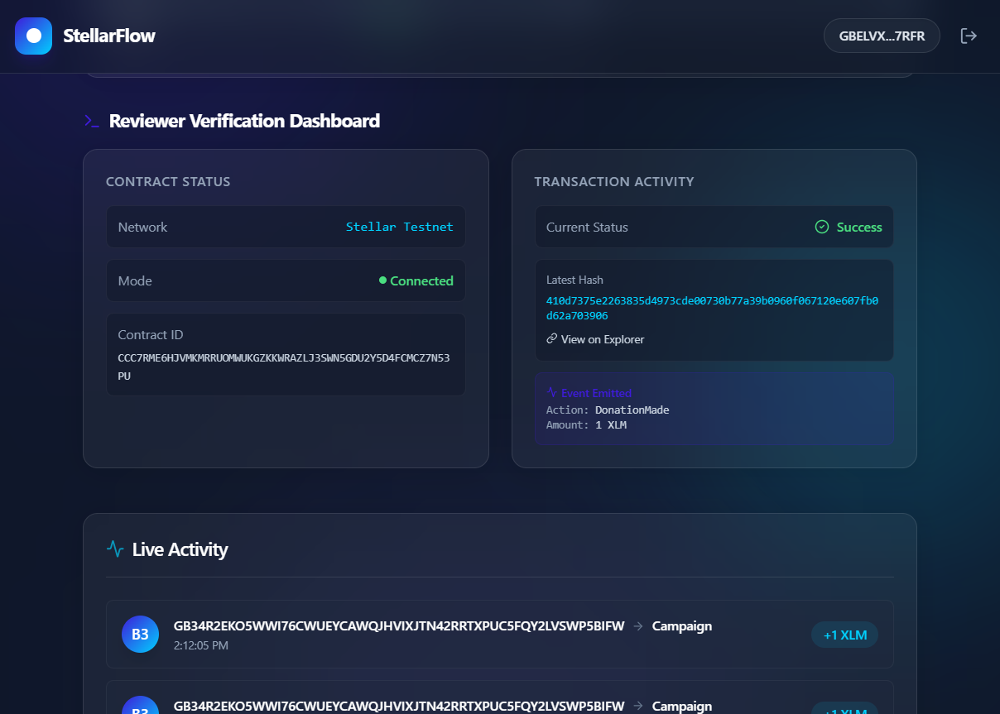
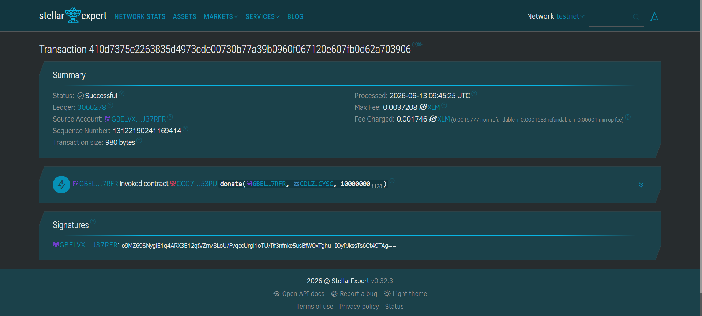

# StellarFlow – Decentralized Crowdfunding on Stellar

A decentralized crowdfunding platform built on the Stellar Network using Soroban Smart Contracts, React, TypeScript, and Stellar Wallets Kit.

Developed for the **Stellar Developers Yellow Belt Level 2 Challenge**.

---

# Live Demo

**Vercel Deployment**

https://stellarflow-yellow-belt-ocoiedpqw-akash-mondal-1s-projects.vercel.app/

---

# Features

### Multi-Wallet Support

* Freighter
* xBull
* Albedo

### Soroban Smart Contract Integration

* Rust-based Soroban smart contract
* Deployed on Stellar Testnet
* Real blockchain transactions
* On-chain campaign state management
* Contract event emission

### Real-Time Activity Feed

* Live donation tracking
* Real transaction hashes
* Real donor wallet addresses
* Soroban event monitoring

### Transaction Tracking

* Pending
* Success
* Failed

### Error Handling

Implemented and tested:

* Wallet not installed
* Wallet connection rejected
* Insufficient balance
* Transaction submission failure
* RPC / Network failure

### Modern UI

* Glassmorphism design
* Responsive layout
* Mobile friendly
* React + TailwindCSS

---

# Smart Contract Information

## Contract Address

```text
CCC7RME6HJVMKMRRUOMWUKGZKKWRAZLJ3SWN5GDU2Y5D4FCMCZ7N53PU
```

## Sample Verified Transaction

```text
c2e843a080652841a358e6885498fabfa8548b045c576e1810d1474b8ba2f9f0
```

## Stellar Explorer Verification

Contract:

https://lab.stellar.org/contract/CCC7RME6HJVMKMRRUOMWUKGZKKWRAZLJ3SWN5GDU2Y5D4FCMCZ7N53PU

Transaction:

https://stellar.expert/explorer/testnet/tx/c2e843a080652841a358e6885498fabfa8548b045c576e1810d1474b8ba2f9f0

---

# Architecture

```text
React + Vite Frontend
        │
        ▼
Stellar Wallets Kit
        │
        ▼
Soroban RPC
        │
        ▼
Crowdfund Smart Contract
        │
        ▼
Contract Events
        │
        ▼
Live Activity Feed
```

---

# Screenshots

## Wallet Selection



## Dashboard



## Successful Donation



## Explorer Verification



---

# Technology Stack

## Frontend

* React
* TypeScript
* Vite
* Tailwind CSS
* Framer Motion

## Blockchain

* Stellar Testnet
* Soroban
* Stellar SDK
* Stellar Wallets Kit

## Smart Contract

* Rust
* Soroban SDK

---

# Local Setup

## Clone Repository

```bash
git clone <repository-url>
cd stellarflow
```

## Install Dependencies

```bash
cd frontend
npm install
```

## Create Environment File

Create:

```bash
frontend/.env
```

Add:

```env
VITE_RPC_URL=https://soroban-testnet.stellar.org
VITE_NETWORK_PASSPHRASE="Test SDF Network ; September 2015"
VITE_CONTRACT_ID=CCC7RME6HJVMKMRRUOMWUKGZKKWRAZLJ3SWN5GDU2Y5D4FCMCZ7N53PU
```

## Run Application

```bash
npm run dev
```

---

# Smart Contract Build

```bash
cd contracts/crowdfund

stellar contract build
```

---

# Yellow Belt Requirement Verification

| Requirement                | Status |
| -------------------------- | ------ |
| Soroban Contract Deployed  | ✅      |
| Frontend Calls Contract    | ✅      |
| Wallet Integration         | ✅      |
| Multi-Wallet Support       | ✅      |
| Transaction Status Display | ✅      |
| Real-Time Event Updates    | ✅      |
| Error Handling Implemented | ✅      |
| Public GitHub Repository   | ✅      |
| README Documentation       | ✅      |
| Screenshot Evidence        | ✅      |

---

# Author

**Akash Mondal**

Built for the **Stellar Developers Yellow Belt Level 2 Challenge**.
